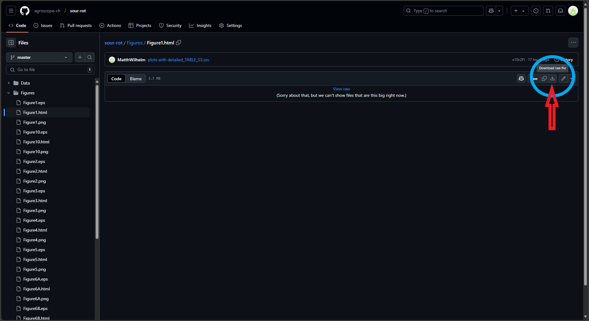

# Sour Rot

This is the repository associated to the paper [Revisiting sour rot of grapevine through disease-associated microbiomes: a tripartite co-infection?](https://www.biorxiv.org/content/10.1101/2024.09.19.613941v1). For the sake of **open-data**, we provide all the data used in the paper in the folder [Data](https://github.com/agroscope-ch/sour-rot/tree/master/Data). 
In addition to providing the data and for the sake of **reproducibility**, we provide the codes that have produced the analyses and the figures of this paper. The codes are provided in the _Rmarkdown_ file [Reproducing_figures_sour_rot.Rmd](https://github.com/agroscope-ch/sour-rot/blob/master/Reproducing_figures_sour_rot.Rmd), that both produce the results and gives details about how they are obtained, so as to make all the preprocessing steps fully transparent. The corresponding (i.e. readable) file [Reproducing_figures_sour_rot.html](https://github.com/agroscope-ch/sour-rot/blob/master/Reproducing_figures_sour_rot.html) can be either downloaded or visualized using this [link](https://html-preview.github.io/?url=https://github.com/agroscope-ch/sour-rot/blob/master/Reproducing_figures_sour_rot.html).

Those analyses are done using standard R pacakges, essentially the [tidyverse](https://www.tidyverse.org/) [[1]](#1)  collection of packages and [metacoder](https://grunwaldlab.github.io/metacoder_documentation/index.html)[[2]](#2)

## Note on downloading the files

As it is customary for github repository, the easiest way to get the repository is by using the following `git clone` command

```
git clone https://github.com/agroscope-ch/sour-rot.git 
```
For more information about what that this precisely mean, [see](https://github.com/git-guides/git-clone).

It is also possible to download all the files separately by clicking on it and then use the top right icon `download raw file`, as shown here



In particular all the files with format that are not natively redered or supported by github (for instance in this repository, `.html` and `.xlsx` files) cannot be visualized without first downloading it. 

## Data

The data are described in full details below and in the paper and are available in the folder [`Data`](https://github.com/agroscope-ch/sour-rot/tree/master/Data). There are 3 different studies, each of which with a `xlsx` file. Some of the results (Figure 8-10) require data at the sample level of the third study, which are provided in the file [`detailed_TABLE_S3.csv`]. 

## Figures

Most of the figures are provided in different formats: 

- `.png` provided for simplicity. 
- `.html` interactive plots, usefull for better exploring the data
- `.eps` required for publication


## References

<a id="1">[1]</a> 
Wickham, H. _et al._ (2019). 
Journal of Open Source Software, 43(4), 1686. [DOI: 10.21105/joss.01686](https://doi.org/10.21105/joss.01686)

<a id="2">[2]</a> 
Z. Foster, T. Sharpton and N. Grünwald (2017). 
PLOS Computational Biology, 13(2), 1-15. [DOI: 10.1371/journal.pcbi.1005404](https://journals.plos.org/ploscompbiol/article?id=10.1371/journal.pcbi.1005404)

## Study of microorganisms for vine sour rot**

1.  **Correspondance information**

    - [Valérie Hofstetter, Agroscope](mailto:valerie.hofstetter@agroscope.admin.ch)
    - [Matthieu Wilhelm, Agroscope](mailto:matthieu.wilhelm@agroscope.admin.ch)
    - [Sébastien Hevin](mailto:sebastien.hevin@gmail.com)

2.  **Date of data collection**

    - `Table_S1_COM1` October 2019
    - `Table_S2_COM2` September 2019
    - `Table_S3_COM3` September 2020

3.  **Information about geographic location of data collection**

- `Table_S1_COM1` Nyon/Landquart, Switzerland
- `Table_S2_COM2` Nyon, Switzerland
- `Table_S3_COM3` Begnins Switzerland

**Data and file overview**

  1.  `Table_S1_Com1`: The file contains information about fungal and
      bacterial isolates collected from grape clusters symptomatic of
      **sour rot** and **grey mould**. The dataset aims to compare
      microbial communities associated with these diseases across
      different vineyard regions and grape cultivars.

  2.  `Table_S2_Com2`: The file contains information about fungal and
      bacterial isolates collected from wounded and net-protected
      clusters, healthy berries, and unwounded clusters over one, two,
      and three weeks.

  3.  `Table_S3_Com3`: The file contains information about fungal isolates
      collected from the pulp of surface-sterilized healthy berries,
      from the surface of unsterilized healthy berries, form sour rot
      symptomatic berries and from the surface of *Drsosophila spp.*

**Year of file creation: 2024**

**Methodological information**

1.  **Description of methods for data collection or generation** 

    1.  Com1: Grape clusters were harvested using pruning shears and  immediately placed in individual sterile sealed plastic bags.  The samples were kept at room temperature in plastic bags for  two weeks for microorganisms’ enrichment before being crushed.  Subsequently, 1 ml of the material was spread onto Petri dishes  (9 cm Ø) containing potato dextrose agar (PDA potato infusion  4 g/L, D(+)-glucose 20 g/L, agara agar 15 g/L Merk, Darmstadt,  Germany). The pH of the PDA medium ranged between 5.4 -5.8,  which is adapted to AAB cultivation according to de Ley et  al. (1984) who found that the optimal pH to cultivate AAB is 5  to 6, although they can still grow well at pHs below 4. Petri  dishes were then sealed with Parafilm®M, which is permeable to  oxygen, and kept at room temperature (23-25 °C) for three weeks.  We examined dishes daily over four weeks and as soon as fungi or  bacteria became visible, they were isolated onto new PDA Petri  dishes (6 cm Ø) to obtain them in pure culture.
    2.  Com2: To assess the impact of fungi, bacteria, insect vectors  and wounds on the evolution of the microbial communities of  berries and the expression of sour rot, an exclusion experiment  was conducted in 2019. The evolution of the microbial community  was monitored over the course of three weeks on healthy and  artificially wounded grape clusters in the presence or absence  (protected by insect-proof nets, 1 mm mesh allowing direct  exchange of air and steam) of Drosophila flies. In a Chasselas  vineyard of Agroscope at Nyon, 36 grape clusters were selected  for the experiment. In early September, 18 grape clusters were  protected from insects with iron cages covered with insect-proof  nets, while the remaining 18 grape clusters were left  unprotected. In each of these two Clusters, ten berries on  half (9) of the grape clusters were artificially wounded using a  scalpel sterilized with 70$\%$ ethanol, The experiment consisted  thus of four different treatments repeated on nine independent  grape clusters: protected and unwounded, protected and wounded,  unprotected and unwounded as well as unprotected and wounded  clusters. Grape clusters were sampled at a weekly interval for  three weeks. The first sampling was carried out one week after  the set-up of the experiment and consisted in pruning three  clusters per modality which were then placed individually in  sterile, airtight plastic bags. Back in the laboratory, two  artificially wounded berries and two unwounded berries adjacent  to the wounded berries were collected from each of the six  wounded grape clusters. Similarly, two berries were randomly  picked from each of the six unwounded grape clusters. This  sampling procedure was repeated in week two and three following  the wounding of the berries. Berries were brought back to the  laboratory as soon as they were collected and each sampled berry  opened using a sterile scalpel and twezeers Brussels used to rub  berry material onto PDA Petri dishes (9 cm Ø) for 1 minute. As  in the survey described above, plates were controlled daily for  the development of microorganisms. For four weeks, emerging  fungi and bacteria were transferred to new PDA Petri dishes (6  cm Ø) as soon as they became visible to obtain them in pure  culture.
    3.  Com3: To determine if the fungi present on the surface of healthy berries or on the bodies of Drosophila species may act as potential reservoirs for the mycobiome associated with sour rot symptomatic berries, a vineyard of the Gamay cultivar affected by this disease was surveyed in Begnins near Nyon (Switzerland) in 2020. A total of 18 grape clusters (eight symptomatic and ten asymptomatic) were collected in airtight sterile plastic bags between September 14th and September 23rd, 2020. To isolate only the microorganism community present inside of the berries, the eight symptomatic grape clusters were rinsed in tap water for one hour immediately upon arrival in the laboratory. Following this step, eight sour rot affected berries per grape cluster were sampled, rinsed several times with sterile water and left half an hour to dry under a laminar flow. We could not apply a 70$\%$ ethanol sterilization method because sour rot symptomatic berries had a damaged skin, with openings that would have let the ethanol to enter the berries and kill part of the microorganisms living inside them. Seven small pieces of each berry were sampled using a sterile scalpel and placed equidistantly on a PDA Petri dish (9 cm Ø). From the ten healthy grape clusters, eight berries were randomly collected per cluster. Half of these berries were rinsed under tap water for half an hour, then their surface was sterilized in 70$\%$ ethanol for 1 minute. Once their surface was dry, the berries were cut into small pieces with a sterile scalpel under a laminar flow. Seven samples of each of these berries (skin and pulp) were placed on PDA Petri dish (9 cm Ø). The other half of the berries were not surface sterilized and carefully rubbed individually on PDA Petri dishes using tweezers Brussels during 1 min to isolate the microorganisms present on the surface of healthy berries. As before, and for each treatment (sour rot symptomatic berries, asymptomatic surface-sterilized berries, and asymptomatic non-surface-sterilized berries), fungi were isolated in pure culture. To capture Drosophila adults alive, three homemade insect traps were placed in the Gamay vineyard at Begnins, with a second cylinder added inside. The bottom of this second cylinder was removed and fitted into the cylinder that contained the fly attractant with an insect net separating the two cylinders to prevent specimens from drowning in the attractant. The traps were checked daily from September 8th to 14th 2020. After identification of the vinegar flies, five individuals were placed equidistantly on a PDA Petri dish (9 cm Ø), with D. suzukii and endemic species placed in separate dishes (57 individuals for D. suzukii and 52 for endemic drosophilid spp.). The vinegar flies were pressed into the culture medium to immobilize them. As in the previous experiment, the Petri dishes were surveyed daily for four weeks to isolate the emerging fungi and bacteria in pure culture as soon as they were visible.

2. **Description of methods used for data processing**

    As soon as the fungi isolated in pure culture were sufficiently developed (0.5 cm2), direct amplification of the ribosomal nuclear DNA internal transcribed spacers 1 and 2 plus the 5.8S (ITS) was performed according to [Hofstetter et al. 2012)](https://link.springer.com/article/10.1007/s13225-012-0171-z). For the bacteria isolated in pure culture, we amplified the ribosomal nuclear small subunit (16S) using two different primer pairs to amplify this locus in order to maximize the number of successful PCRs: 8F/1492R designed by [Galkiewicz $\&$ Kellogg (2008)](https://journals.asm.org/doi/10.1128/aem.01303-08) and 341f/785r designed by [Thijs et al. (2017)](https://www.frontiersin.org/journals/microbiology/articles/10.3389/fmicb.2017.00494/full). Direct PCR was performed using a sterile pipettor tip (10 μl) to aseptically transfer a tiny amount of mycelium or bacteria in a PCR tube and to squash it manually with the tip in the PCR mix (25 μl mix, reagents, and conditions of the Taq PCR core kit (QIAGEN, Inc., Valencia, California, USA). While it was easy to discriminate bacteria from fungi growing in a mycelial form, it was not possible to discriminate yeasts, particularly abundant in our experiments, from bacteria by visual inspection of the colonies. We therefore adopted a strategy based on the success or failure of direct amplification of the fungal ITS using primers ITS1F and ITS4, then ITS1-ITS4 alternately for isolates for which no PCR product had been obtained with ITS1F, to discriminate fungi from bacteria. For isolates for which no PCR product had been obtained with the fungal primers, we used the bacterial primer pairs (8F/1492R and 341f/785r). When direct amplification of fungal ITS and bacterial 16S had failed, we performed genomic DNA extractions according to Hofstetter et al. (2012) using material sampled from pure each isolate (50-70 mg) as soon as they were sufficiently developed (1-3 weeks after cultivation), which were placed individually in Eppendorf tubes containing 500 µl CTAB buffer (1x). Direct PCR was performed immediately after these samples were taken. PCR products were sequenced in both directions by ©Eurofins Genomics (Ebersberg, Germany) or by Fasteris Life Science Genesupport (Geneva, Switzerland) using the same primer pair as for amplification.

    The obtained sequences were assembled using the Sequencher v. 4.9 software (Gene Codes Corp., USA). Once assembled, they were verified by eye and sequences were then imported in MacClade v. 4 (Maddison &  Maddison 1992) (Maddison WP, Maddison DR. 1992 – MacClade: analysis of phylogeny and character evolution. Sinauer Associates.) and for each locus (ITS and 16S) aligned manually. Since the primers used to amplify ITS are designed at the end of the small nucleic ribosomal subunit (SSU) and at the beginning of the large ribosomal subunit (LSU) for ITS1(or ITS1F) and ITS4 respectively, sequence alignment allowed ITS delimitation. The sequences of each locus were then subjected to a similarity search in Sequencer with an assembly parameter of 100$\%$ to determine the number of genotypes present in our samplings. Two different nucleotide similarity searches [https://blast.ncbi.nlm.nih.gov/](https://blast.ncbi.nlm.nih.gov/) were performed for each genotype in the GenBank (National Center of Biotechnology Information). The first sequence similarity search used the "blastn" options (Megablast) and excluded "uncultured/environmental" sequences. The second was conducted using the option “Sequences from type material”. The name associated with the most similar sequence(s) ("BLAST top score(s)" expressed as $\%$) in GenBank was adopted to name our isolates, favoring, when possible, the names associated with sequences from type material, this when BLAST top score of type sequence(s) exhibited a similarity percentage equal to the Megablast top score sequence(s). The similarity threshold values of BLAST top score(s) adopted to name sequences at systematic ranks followed [Hofstetter et al. (2019)](https://link.springer.com/article/10.1007/s13225-019-00428-3) but using higher sequence similarity thresholds for species ranks. Species name associated to the BLAST top score(s) of our ITS or 16S sequences was only adopted when similarity with a GenBank sequence was 100$\%$. When the isolated fungal species belonged to Ascomycota species complexes in which several cryptic species share identical ITS sequences, we retained only the genus rank. The suffixes cf. (likely that species) and aff. (close but might not be that species) were used for 99.5-99.9$\%$ and for 99.0-99.49$\%$   sequence similarity intervals respectively. Below 99$\%$ of sequence similarity, the isolates were assigned to genus, family or higher ranks. When assigning family and order ranks to our taxa, the classification presented in GenBank was followed. For species names we followed GenBank, but we verified for the species current name in Mycobank.


**Variable list, including full names and definitions of column headings**

[`TABLE_S1_COM1.xlsx`](https://zenodo.org/records/14958216/files/TABLE_S1_COM1.xlsx?download=1)

| Column Heading | Full Name and Definition |
|---------|---------------------------------------------------------------|
| A | Sequences 16S or ITS named after verification (in LPSN for bacteria and Mycobank/Index Fungorum for fungi): The names of the bacterial (16S) or fungal (ITS) sequences after verification in LPSN (for bacteria) or Mycobank/Index Fungorum (for fungi), based on sequence similarity searches in GenBank. |
| B | A: Fungi isolated from sour rot symptomatic clusters of several cultivars harvested in Grisons. |
| C | B: Bacteria and fungi isolated from sour rot symptomatic clusters of several cultivars harvested in Vaud. |
| D | C: Bacteria and fungi isolated from sour rot symptomatic clusters harvested in a single vineyard plot at Nyon (Vaud). |
| E | D: Bacteria and fungi isolated from grey mould symptomatic clusters harvested in a single vineyard plot at Nyon (Vaud). |
| F | Taxon authorities at genus or species rank: The taxonomic authorities for the genus or species names, depending on the resolution power of 16S or ITS sequences. |
| G | Bacteria or fungi isolate number: The unique identifier for each bacterial or fungal isolate. |
| H | GenBank accessions for bacterial (16S) or fungal (ITS) sequences: The GenBank accession numbers for the 16S (bacterial) or ITS (fungal) sequences. |
| I | GenBank BLAST top score sequence(s) accession(s): The accession numbers of the top BLAST score sequences in GenBank. |
| J | GenBank BLAST top score(s) sequences similarity ($\%$): The percentage similarity between the query sequence and the top BLAST hit in GenBank. |
| K | GenBank BLAST top score(s) sequences coverage ($\%$): The percentage of the query sequence covered by the top BLAST hit in GenBank. |
| L | Order; family (after GenBank): The taxonomic order and family of the organism as identified in GenBank. |

Summary of Abbreviations:

- 16S: 16S ribosomal RNA gene (bacterial DNA barcode)
- ITS: Internal Transcribed Spacer (fungal DNA barcode)
- LPSN: List of Prokaryotic names with Standing in Nomenclature (for bacteria)
- Mycobank: A database for fungal taxonomy
- Index Fungorum: A database for fungal names and taxonomy
- BLAST: Basic Local Alignment Search Tool (used for sequence similarity searches)
- cf.: Latin for "confer," meaning "compare to" (used when the identification is tentative)
- aff.: Latin for "affinis," meaning "related to" (used when the organism is related to but not definitively identified as a known species)
- f.: Form (a taxonomic rank below species)

[`TABLE_S2_COM2.xlsx`](https://zenodo.org/records/14958216/files/TABLE_S2_COM2.xlsx?download=1)

| Column Heading | Full Name and Definition |
|----------|--------------------------------------------------------------|
| A | 16S or ITS sequences named based on GenBank BLAST top score(s): The names of the bacterial (16S) or fungal (ITS) sequences based on the top BLAST score in GenBank, after verification of the taxon names in taxonomic databases. |
| B | A W P 1: Isolates (bacteria or fungi) from wounded (W) and net-protected (P) clusters after one week. |
| C | B W P 2: Isolates (bacteria or fungi) from wounded (W) and net-protected (P) clusters after two weeks. |
| D | C W P 3: Isolates (bacteria or fungi) from wounded (W) and net-protected (P) clusters after three weeks. |
| E | D W UP 1: Isolates from wounded (W) and not net-protected (UP) clusters after one week. |
| F | E W UP 2: Isolates from wounded (W) and not net-protected (UP) clusters after two weeks. |
| G | F W UP 3: Isolates from wounded (W) and not net-protected (UP) clusters after three weeks. |
| H | G HA UP 3: Isolates from healthy berries adjacent to sour rot symptomatic berries (HA) after three weeks. |
| I | H UW UP 1: Isolates from unwounded (UW) and not net-protected (UP) clusters after one week. |
| J | I UW UP 2: Isolates from unwounded (UW) and not net-protected (UP) clusters after two weeks. |
| K | J UW UP 3: Isolates from unwounded (UW) and not net-protected (UP) clusters after three weeks. |
| L | K UW P 1: Isolates from unwounded (UW) and net-protected (P) clusters after one week. |
| M | L UW P 2: Isolates from unwounded (UW) and net-protected (P) clusters after two weeks. |
| N | M UW P 3: Isolates from unwounded (UW) and net-protected (P) clusters after three weeks. |
| O | Taxon authorities at genus or species rank: The taxonomic authorities for the genus or species names, depending on the resolution power of 16S or ITS sequences. |
| P | Bacteria or fungi isolate number: The unique identifier for each bacterial or fungal isolate. |
| Q | GenBank accessions for bacterial (16S) or fungal (ITS) sequences: The GenBank accession numbers for the 16S (bacterial) or ITS (fungal) sequences. |
| R | GenBank BLAST top score sequence(s) accession(s): The accession numbers of the top BLAST score sequences in GenBank. |
| S | BLAST top score sequence(s) similarity ($\%$): The percentage similarity between the query sequence and the top BLAST hit in GenBank. |
| T | BLAST top score sequence query coverage ($\%$): The percentage of the query sequence covered by the top BLAST hit in GenBank. |
| U | Order; family (after GenBank): The taxonomic order and family of the organism as identified in GenBank. |

[`TABLE_S3_COM3.xlsx`](https://zenodo.org/records/14958216/files/TABLE_S3_COM3.xlsx?download=1)

| Column Heading | Full Name and Definition |
|----------|--------------------------------------------------------------|
| A | Sequences 16S or ITS named after verification in Mycobank/Index Fungorum: The names of the fungal ITS sequences after verification in Mycobank or Index Fungorum, based on sequence similarity searches in GenBank. |
| B | A heal S pulp + skin: Fungi isolated from the pulp and skin of surface-sterilized (S) healthy (heal) berries. |
| C | B heal US skin: Fungi isolated from the surface of unsterilized (US) healthy (heal) berries. |
| D | C sour rot US skin: Fungi isolated from sour rot symptomatic berries (unsterilized, US). |
| E | D Dros US flies: Fungi isolated from the surface of Drosophila spp. (flies). |
| F | Taxon authorities at genus or species rank: The taxonomic authorities for the genus or species names, depending on the resolution power of ITS sequences. |
| G | Fungi isolates number: The unique identifier for each fungal isolate. |
| H | GenBank accessions for fungal sequences: The GenBank accession numbers for the fungal ITS sequences. |
| I | BLAST top score sequence(s) in GB: The accession numbers of the top BLAST score sequences in GenBank. |
| J | BLAST top score sequence similarity ($\%$): The percentage similarity between the query sequence and the top BLAST hit in GenBank. |
| K | BLAST top score sequence query coverage ($\%$): The percentage of the query sequence covered by the top BLAST hit in GenBank. |
| L | Subphylum; order; family (after Mycobank): The taxonomic subphylum, order, and family of the fungi as identified in Mycobank. |

Summary of Abbreviations:

- W: Wounded
- P: Net-protected
- UP: Not net-protected
- UW: Unwounded
- HA: Healthy berries adjacent to sour rot symptomatic berries
- S: Surface-sterilized
- US: Unsterilized
- Dros: Drosophila spp. (flies)
- heal: Healthy berries
- GB: GenBank
- ITS: Internal Transcribed Spacer (fungal DNA barcode)
- 16S: 16S ribosomal RNA gene (bacterial DNA barcode)

[`detailed_TABLE_S3.csv`](https://zenodo.org/records/14958216/files/detailed_TABLE_S3.csv?download=1)

1.  species: The specific name of the fungal species.
2.  genus: The genus to which the species belongs.
3.  family: The family to which the genus belongs.
4.  order: The order to which the family belongs.
5.  Subphylum: The subphylum to which the order belongs.
6.  G11C1 to G11C8: Columns representing data for Cluster 11, Berries 1 to 8.
7.  G12C1 to G12C8: Columns representing data for Cluster 12, Berries 1 to 8.
8.  G13C1 to G13C8: Columns representing data for Cluster 13, Berries 1 to 8.
9.  G14C1 to G14C8: Columns representing data for Cluster 14, Berries 1 to 8.
10. G15C1 to G15C8: Columns representing data for Cluster 15, Berries 1 to 8.
11. G4B2 to G4B8: Columns representing data for Cluster 4, Berries 2 to 8.
12. G5B1 to G5B8: Columns representing data for Cluster 5, Berries 1 to 8.
13. G8B1 to G8B8: Columns representing data for Cluster 8, Berries 1 to 8.
14. G9B1 to G9B8: Columns representing data for Cluster 9, Berries 1 to 8.
15. G10B1 to G10B8: Columns representing data for Cluster 10, Berries 1 to 8.
16. G16B1 to G16B8: Columns representing data for Cluster 16, Berries 1 to 8.
17. G16BL: Column representing data for Cluster 16, Block L.
18. G17B1 to G17B8: Columns representing data for Cluster 17, Berries 1 to 8.
19. G17BL: Column representing data for Cluster 17.
20. G18B1 to G18B8: Columns representing data for Cluster 18, Berries 1 to 8.
21. G18BL: Column representing data for Cluster 18.
22. male1 to male6: Columns representing data for male samples 1 to 6.
23. female1 to female6: Columns representing data for female samples 1 to 6.
24. other1 to other6: Columns representing data for other samples 1 to 6.

